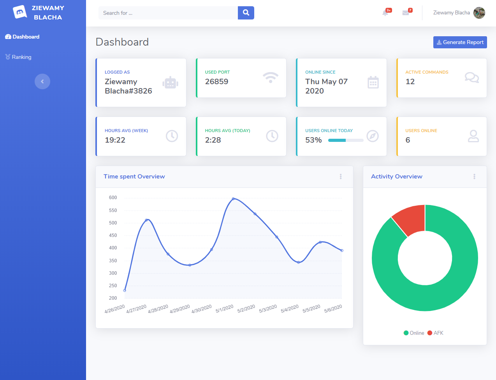
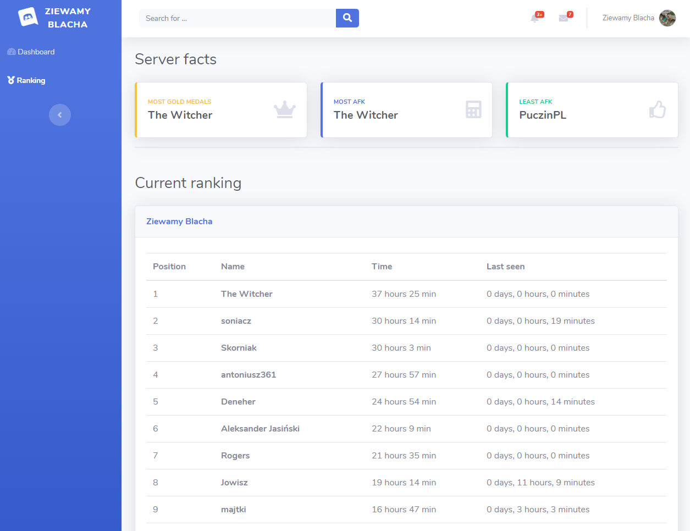

# Discord Bot with users statistics, League of Legends API and Dashboard.

## About:
Made as a side project for me and my friends during my first steps in JavaScript. Made using [Discord.js](https://discord.js.org/#/) and Bootsrap studio for Dashboard. It was made for personal use but if you would like to use it go on. It probably contains some bugs and it's not perfect. If you've spotted something please file an issue.

**Best to use with your small group of friends.**
**Right now it won't work great on big servers with multiple channels and hundreds of users.**

## Features:
Main feature of this bot is to **track users statistics**:
1. Last time they where in the channel.
2. Total number of hours online or afk today/weekly/all.
3. Display server activity ranking.

**Check recent server statistics on web based dashboard.**
   
It also get's information from Riot Servers about summoners, games etc.
I don't think is very scallable and probably is for small group of friends that want to see some stats for fun. I've tested it with 19 other users and it performed fine.

### Time tracking explained:
> Every minute server checks for online users and then updates the data. Every 15 minutes data is being sent to online spreadsheet. It separates time spent on mute with the time spent "active". I've chosen Google Sheets over regular database. It gives ability for sharing the spreadsheet, easy printing, graphs, data analisys etc. I think in this scenario it works great.
> Every week on Monday the week data is erased and the awards are given so users can be proud of their accomplishments.
> All the time users can see their position in ranking with `$ranking`, page *Ranking* in the Dashboard or more detailed stats with `$seen @<mention user>` like *the last time user was seen*.

## Commands:

- **Link shortening**:
    type `$shorten <link>` to get shortened link from server.
- **Summoner data**:
    type `$summoner <summoner name>` to get data about current division/rank etc.
- **Live game**:
    type `$livegame <summoner name>` to check if the player is currently playing and for how long.
- **Last game**:
    type `$lastgame <summoner name>` to get data about summoner's last game.
- **Rotation**:
    type `$rotation` to get data about current rotation.
- **Last seen**:
    type `$seen @<mention user>` to check when was the last time user was in the voice channel. It also saves how many minutes user was connected to the channel.
- **Ranking**:
    type `$ranking` to see current ranking of most active (who is most often logged in) users.
- **Coronavirus statistics**:
    type `$corona <country name>` to check recent stats about Coronavirus in this country.
- **More still in development...**

## What do you need if you really want one?
- Follow the guide [here](instalation_guide/GUIDE.md).
- You have to get your own API key from RIOT GAMES. Get one [here](https://developer.riotgames.com/).
- Create account with Google Sheets API enabled. **Described in guide.**
- Create Google spreadsheet from attached schema [Sheet DB Template](instalation_guide/discord_bot_db.xlm).
- For the `$corona` functionality you need [this API key](https://rapidapi.com/api-sports/api/covid-193/endpoints).
- [Heroku](https://www.heroku.com) is a good option to deploy this.

## Dashboard screenshots:

